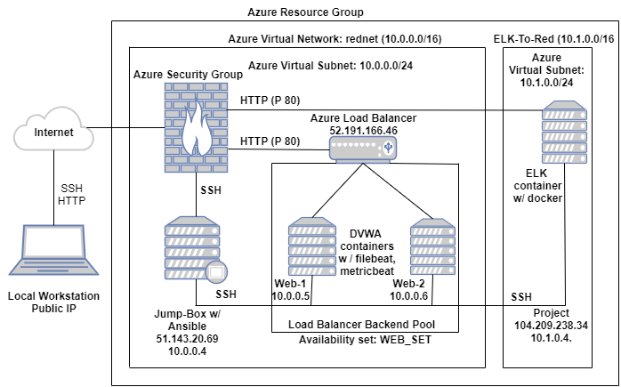

# Elk-Stack-Project
### This project creates infrastructure behind SIEM - Kibana, using Linux Scripts and Ansible Scripts to configure cloud servers with different docker containers.
### The final setup consisted of 2 webservers running DVWA containers, Jump-Box running an ansible provisional and an Elk server running ELK stack.

#### Cloud-Infrastructure:

#### Instructions
Make sure that you are logged into your personal Azure account

#### Creating an Environment
In Azure, resource groups allow engineers to sort related resources into different groups, each of which can be easily located by name.

* Open your Azure portal and search for "resource group" to demonstrate.

* Select Resource groups in the search results and note the + Add button at the top.

* Select a region, In this project we are using West US 2

* Every resource that you create will have this button at the top.

Now that we have a resource group, we can add a virtual network.

####  Create a New vNet
Create a new vNet located in the same resource group.

Make sure this vNet is located in same region as the Resource Group.

Leave the rest of the settings at default.

Notice that the IP Addressing has automatically created a new network space of 10.0.0.0/16 as expected.

#### Setup Network Security Group (firewall) to protect the virtual network

* Open your Azure portal and search for "Network security group."

* Use the + Add button to add a network security group.

* Name the group something memorable.

* Once the group is created, click Go to resource.

* Click Inbound rules on the left side to set the rules that allow inflow of traffics.

#### Create a Virtual Machine, name it Jump-Box-Provisioner

* Navigate to your Azure portal, search for "Virtual" and select Virtual machines.

* Click + Add to create a new VM.

* Name this VM "Jump-Box-Provisioner."

* Under 'Availability Options' set it to No Infrastructure Redundancy

* set image to Ubuntu Server 18.04 LTS

* Size to Standard B1s

#### SSH SETUP
Accessing a server using a password is the weakest form of authorization: many programs can brute force an SSH password. Instead, so we will use an SSH key pair to access our new machine.

* Open a terminal and run `ssh-keygen`.

* You will be prompted to save the SSH key into the default directory ~/.ssh/id_rsa. DO NOT CHANGE THIS LOCATION. Press the Enter key.

* You will be prompted to enter a password for our new SSH key.

  * DO NOT ENTER A PASSWORD. Press the enter key twice to enter a blank password

* Run `cat ~/.ssh/id_rsa.pub` to show your id_rsa.pub key:

* Copy the SSH key string and paste it into the Administrator Account section on the Basics page for the VM in Azure.

  * For SSH public key source select Use existing public key from the drop down.
  * You will use the same SSH key for every machine you create for this project

#### Create VMs 2 and 3 - The Web VM's
We Created 2 more new VMs with the following properties:

* named "Web-1" and "Web-2"

* resource group Red Team.

* Each VM located in the same region as the resource and security groups.

* We chose an administrative username - azdmin.

 * You should use the same admin name for all 3 machines.

* Setup ssh connection

  * For these machines, we used the ssh key that was created for the first machine.
  * Run `cat ~/.ssh/id_rsa.pub` to get the public key.

* Choose the VM option that has:

  * Whose offering is Standard - B1ms

    * 1 CPU
    * 2 RAM

It is crucial to make sure both of these VM's are in the same availability Set.

* Under Availability Options, we selected 'Availability Set'.
* Clicked on 'Create New' under the Availability set.
* We named it "Web-Set". for both VMs.
* Then Save the changes.

* Under Networking:

 * We ensure that these new VMs are assigned to the security group.

 * Also that these machines do not have public IP addresses by setting the Public IP to 'None' for both.
 
 #### Jump Box Administration
 
 * We started by identifying your public IP address
  * Browse myipv4 to reveal your public IP address
  
 * Then in the azure.com account, we searched for Network Securitry Group we created previously
   * we created a rule to allow connection from our public IP Address to the VM's internal IP address via the Inbound security rules.
   
 * On the command line, we then ssh into the VM for administration
   * The command to ssh into the VM is `ssh azdmin@51.143.20.69` where azdmin is username and 51.143.20.69 is Jump-Box-Provisioner public IP address.
   
   #### Installing Docker containers into the VMs
   Docker is the most common program used to manage containers
   
   * Steps
     * While connected to the Jump-Box, we performed the following commands:
     * `$ apt-get update`
     * `$ sudo apt-get install docker.io`
     * `$ sudo systemctl status docker`
     * `$ sudo systemctl start docker` to start docker service
   * We installed an image that we want to use for the project
     * `$ sudo docker pull cybersecurity/ansible`
     * `$ sudo docker run -ti cybersecurity/ansible bash`
     * `$ docker run` note: this should only be run once after the installation of the docker.io
      
  #### YAML
  The Ansible container has full access to our VNet and can make a connection with our new VM.
  Each time we start our Virtual machines, we usually ran some few linux commands to start the ansible container and attach it, this below script was written to enhance performance.
  
  

The username can be any name, but it must be something the students will not forget. The SSH public key must be copied from the machine.

Create a Peer connection between your vNets. This will allow traffic to pass between your vNets and regions. This peer connection will make both a connection from your first vNet to your Second vNet And a reverse connection from your second vNet back to your first vNet. This will allow traffic to pass in both directions.

Navigate to 'Virtual Network' in the Azure Portal.

Select your new vNet to view it's details.

Under 'Settings' on the left side, select 'Peerings'.

Click the + Add button to create a new Peering.

Make sure your new Peering has the following settings:

A unique name of the connection from your new vNet to your old vNet.

Elk-to-Red would make sense

Choose your original RedTeam vNet in the dropdown labeled 'Virtual Network'. This is the network you are connecting to your new vNet and you should only have one option.

Name the resulting connection from your RedTeam Vnet to your Elk vNet.

Red-to-Elk would make sense

Leave all other settings at their defaults.
