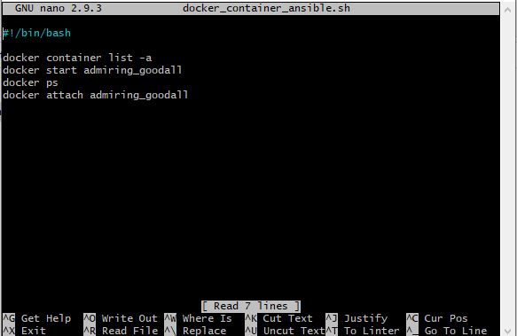
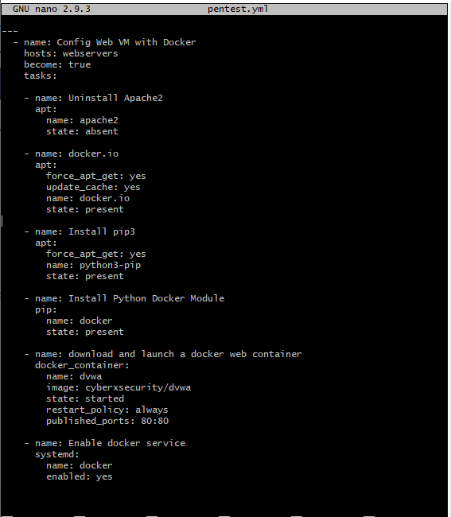
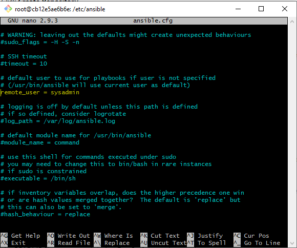
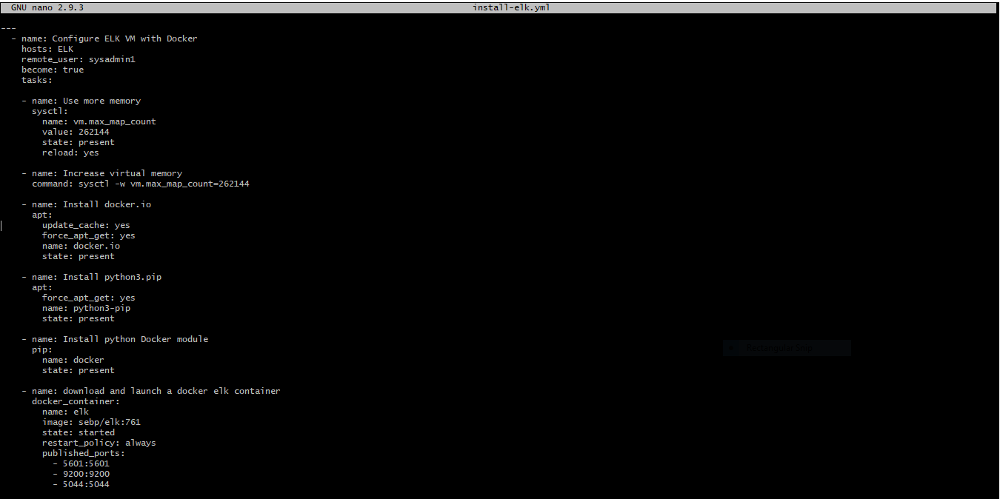
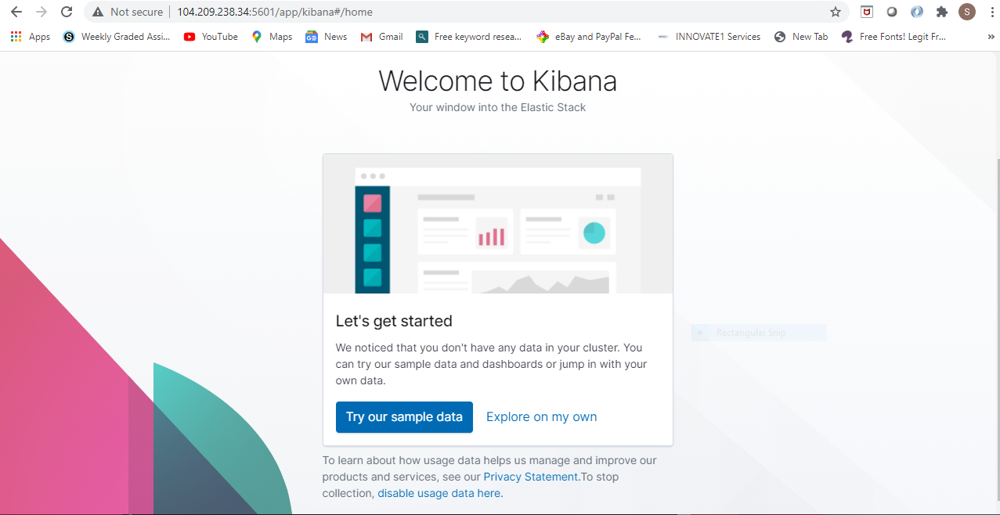
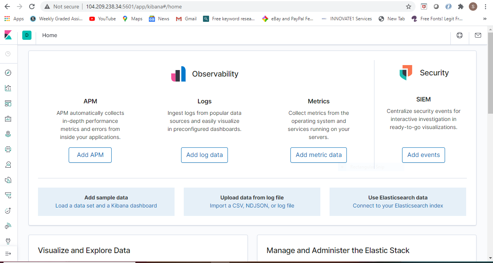
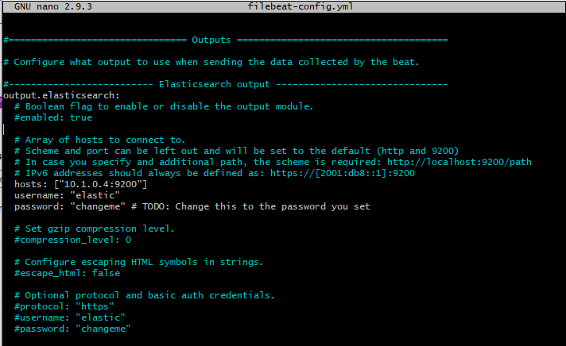
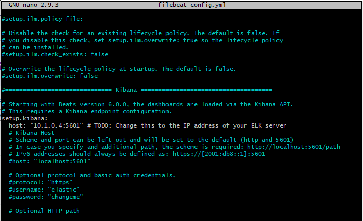
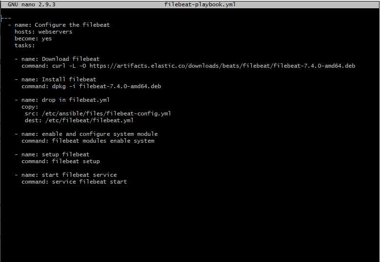
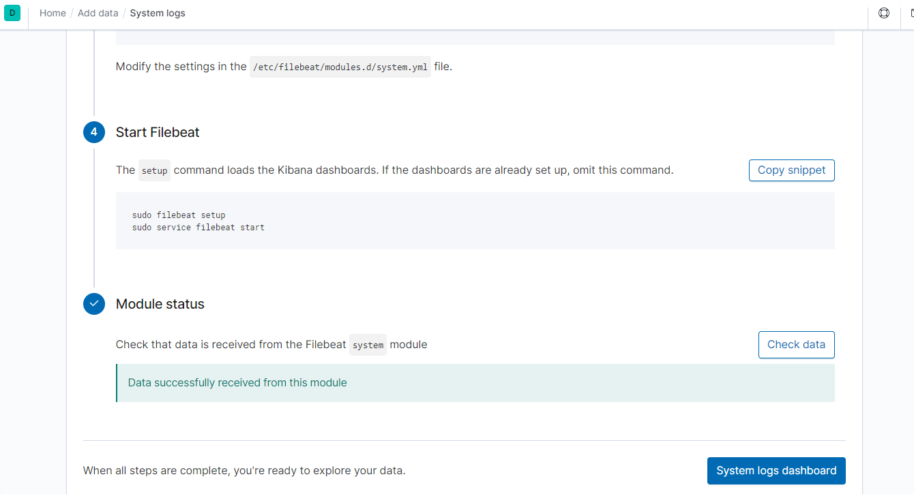

# Cloud Computing
## Elk-Stack-Project
### This project creates infrastructure behind SIEM - Kibana, using Linux Scripts and Ansible Scripts to configure cloud servers with different docker containers.
### The final setup consisted of 2 webservers running DVWA containers, Jump-Box running an ansible provisional and an Elk server running ELK stack.

#### Cloud-Infrastructure:

#### Instructions
Make sure that you are logged into your personal Azure account

#### Creating an Environment
In Azure, resource groups allow engineers to sort related resources into different groups, each of which can be easily located by name.

* Open your Azure portal and search for "resource group" to demonstrate.

* Select Resource groups in the search results and note the + Add button at the top.

* Select a region, In this project we are using West US 2

* Every resource that you create will have this button at the top.

Now that we have a resource group, we can add a virtual network.

####  Create a New vNet
Create a new vNet located in the same resource group.

Make sure this vNet is located in same region as the Resource Group.

Leave the rest of the settings at default.

Notice that the IP Addressing has automatically created a new network space of 10.0.0.0/16 as expected.

#### Setup Network Security Group (firewall) to protect the virtual network

* Open your Azure portal and search for "Network security group."

* Use the + Add button to add a network security group.

* Name the group something memorable.

* Once the group is created, click Go to resource.

* Click Inbound rules on the left side to set the rules that allow inflow of traffics.

#### Create a Virtual Machine, name it Jump-Box-Provisioner

* Navigate to your Azure portal, search for "Virtual" and select Virtual machines.

* Click + Add to create a new VM.

* Name this VM "Jump-Box-Provisioner."

* Under 'Availability Options' set it to No Infrastructure Redundancy

* set image to Ubuntu Server 18.04 LTS

* Size to Standard B1s

#### SSH SETUP
Accessing a server using a password is the weakest form of authorization: many programs can brute force an SSH password. Instead, so we will use an SSH key pair to access our new machine.

* Open a terminal and run `ssh-keygen`.

* You will be prompted to save the SSH key into the default directory ~/.ssh/id_rsa. DO NOT CHANGE THIS LOCATION. Press the Enter key.

* You will be prompted to enter a password for our new SSH key.

  * DO NOT ENTER A PASSWORD. Press the enter key twice to enter a blank password

* Run `cat ~/.ssh/id_rsa.pub` to show your id_rsa.pub key:

* Copy the SSH key string and paste it into the Administrator Account section on the Basics page for the VM in Azure.

  * For SSH public key source select Use existing public key from the drop down.
  * You will use the same SSH key for every machine you create for this project

#### Create VMs 2 and 3 - The Web VM's
We Created 2 more new VMs with the following properties:

* named "Web-1" and "Web-2"

* resource group Red Team.

* Each VM located in the same region as the resource and security groups.

* We chose an administrative username - azdmin.

 * You should use the same admin name for all 3 machines.

* Setup ssh connection

  * For these machines, we used the ssh key that was created for the first machine.
  * Run `cat ~/.ssh/id_rsa.pub` to get the public key.

* Choose the VM option that has:

  * Whose offering is Standard - B1ms

    * 1 CPU
    * 2 RAM

It is crucial to make sure both of these VM's are in the same availability Set.

* Under Availability Options, we selected 'Availability Set'.
* Clicked on 'Create New' under the Availability set.
* We named it "Web-Set". for both VMs.
* Then Save the changes.

* Under Networking:

 * We ensure that these new VMs are assigned to the security group.

 * Also that these machines do not have public IP addresses by setting the Public IP to 'None' for both.
 
 #### Jump Box Administration
 
 * We started by identifying your public IP address
  * Browse myipv4 to reveal your public IP address
  
 * Then in the azure.com account, we searched for Network Securitry Group we created previously
   * we created a rule to allow connection from our public IP Address to the VM's internal IP address via the Inbound security rules.
   
 * On the command line, we then ssh into the VM for administration
   * The command to ssh into the VM is `ssh azdmin@51.143.20.69` where azdmin is username and 51.143.20.69 is Jump-Box-Provisioner public IP address.
   
   #### Installing Docker containers into the VMs
   Docker is the most common program used to manage containers
   
   * Steps
     * While connected to the Jump-Box, we performed the following commands:
     * `$ apt-get update`
     * `$ sudo apt-get install docker.io`
     * `$ sudo systemctl status docker`
     * `$ sudo systemctl start docker` to start docker service
   * We installed an image that we want to use for the project
     * `$ sudo docker pull cybersecurity/ansible`
     * `$ sudo docker run -ti cybersecurity/ansible bash`
     * `$ docker run` note: this should only be run once after the installation of the docker.io
      
  #### YAML
  The Ansible container has full access to our VNet and can make a connection with our new VM.
  Each time we start our Virtual machines, we usually ran some few linux commands to start the ansible container and attach it, this below script was written to enhance performance.
  `$ nano docker_container_ansible.sh`
  
  
  
  * we then ran the following commands: 
    `$ chmod +x docker_container_ansible.sh`
    `$ sudo ./docker_container_ansible.sh`
 This will eacalate our privilege to root.
 
 We then ran the following commands:
   `root@cbe12e5ae6b6e:~# cd /etc/ansible`
   
 We created the YAML file:
    `root@cbe12e5ae6b6e:/etc/ansible# nano pentest.yml`
    
   
   
We edited the ansible.cfg, and hosts files as thus:

   `root@cbe12e5ae6b6e:/etc/ansible# nano ansible.cfg`

   

  
   `root@cbe12e5ae6b6e:/etc/ansible# nano hosts`
   
   
   
   We then ran the playbook to install DVWA on our webservers, Web-1 and Web-2
   
   `root@cbe12e5ae6b6e:/etc/ansible# ansible-playbook pentest.yml`
   
 #### Load Balancer
 
 * From the Azure portal, we searched for "load balancer."

* We added the load balancer with the same + Add button that exists on other pages in the Azure portal.

* We selected the same Resource Group.

* We provided a Name

* We selected 'Create New' for the Public IP address setting.

* We gave the public IP a name

* For the IP Assignment, we chose 'Static'

* We clicked on Review + create and confirm.

#### Firewall Configuration 

we want to make sure that the load balancer is configured properly to allow traffic to the VM backend pool.

* From the load balancer details page and we clicked on Load balancing rules on the left side.

* Click the + Add button.

* We selected the Session persistence to be Client IP and Protocol.

* We selected the backend pool, and health probe we configured previously.

#### Assess our webservers via the Load balancer

*  We accessed our webservers through the load-balancer by navigating to http://52.191.166.46/setup.php 

#### Create New vNet

* We created a new vNet located in the same resource group that we have been using.

* We located the vNet into another region and not the same region.

* We Left the rest of the settings at default.

Notice that the IP Addressing has automatically created a new network space of 10.1.0.0/16 which is exactly what you want.

####  Create a New VM, named Project

We created a new Ubuntu VM in your virtual network using the same procedure mentioned above with the following configurations:

* RAM: 4 GB+ (Standard B2s (2vcpus, 4GiB memory)

* IP Address: The VM must have a public IP address.

* Networking: The VM must be added to the new region in which you created your new vNet. You want to make sure you select your new vNEt and allow a new basic Security Group to be created for this VM.

* Access: The VM must use the same SSH keys as your WebVM's. This should be the ssh keys that were created on the Ansible container that's running on your jump box.

 * From the terminal on our computer, we SSH into the jump box.

 * From the jump box login shell, run the required Docker commands to start and attach to your Ansible container.

 * We used cat to retrieved the public ssh key (~/.ssh/id_rsa.pub), copy and paste into the VM as explained above.

 * After creating the new VM in Azure, verify that it works as expected by connecting via SSH from the Ansible container  on your jump box VM.

  * From the Ansible container shell, SSH into the new VM using it's internal IP.

  * Note that the new VM should be on a new subnet e.g 10.1.0.0/24

  * (If the connection succeeds, you are ready to move on to the next step. If not, verify that you used the correct SSH key (from inside the Ansible container). If the problem persists, you will need to troubleshoot further).

  #### Peering the two vNets

  * We createa a Peer connection between the vNets. This will allow traffic to pass between vNets in different regions. 

   * We navigates to 'Virtual Network' in the Azure Portal.

   * We selected the new vNet to view it's details.

   * Under 'Settings' on the left side, we selected 'Peerings'.

   * We clicked the + Add button to create a new Peering with the following settings:

    * A unique name of the connection from your new vNet to your old vNet. We used Elk-to-Red.

   * We chose our original RedTeam vNet in the dropdown labeled 'Virtual Network'.

    * We named the connection from our RedTeam Vnet to our Elk vNet "Red-to-Elk".

   * We Left all other settings at their defaults.
   
   #### Downloading and Configuring the ELK Container
   
   * From your Ansible container, we added the new VM to Ansible's hosts file.
   
     `root@cbe12e5ae6b6e:/etc/ansible# nano hosts`
    
     
     
   * We created the elk yaml playbook
   
    `root@cbe12e5ae6b6e:/etc/ansible# nano install-elk.ymk`
   
   
   
   * We then ran the paybook with this code:
   
   `root@cbe12e5ae6b6e:/etc/ansible#ansible-playbook install-elk.yml`
    
   * We accessed our ELK server by navigating to "http://[your.ELK-VM.External.IP]:5601/app/kibana" ie. http://104.209.238.34:5601/app/kibana
   
   
   
   * We selected 'Explore on my own'
   
   
   
   #### Filebeat Installation on the DVWA Containers
   
   ##### 1. While the ELK server container is up and running, we clicked 'Explore on my Own', and performed the following tasks:
   
     * We clicked 'Add Log Data'
     * We then chose 'System Logs'
     * We clicked on the 'DEB' tab under 'Getting Started'.
       * We derived the filebeat installation instructions from this site, and if the installation is successful, the site will be updated.
       
   ##### 2. Creating the Filebeat Configuration File
      * From the /etc/ansible working directory, we ran this command to download the filebeat-config.yml file and edit the configuration settings to work with our ELK server.
      
      `curl https://gist.githubusercontent.com/slape/5cc350109583af6cbe577bbcc0710c93/raw/eca603b72586fbe148c11f9c87bf96a63cb25760/Filebeat > /etc/ansible/files/filebeat-config.yml`
      
      * After we downloaded the file into the Ansible container, we edited the file as such:
       * we changed the 'username', the 'password', the 'hosts' IP address and ports number.
       
       
       
       
      
  ##### 3. Creating the FileBeat Installation Play
  
      * We created the filebeat-playbook.yml that we will use to installs the Filebeat and then copies the Filebeat configuration file to the correct location, as shown below:
        * We name the playbook as 'filebeat-playbook.yml'
      
  
   
   
      * We saved the file in roles directory, and ran the filebeat-playbook.yml to install Filebeat on the DVWA machines:
      
      `root@cbe12e5ae6b6e:/etc/ansible/roles#ansible-playbook filebeat-playbook.yml`
   
   ##### 4. Verifying Installation and Playbook
   
   After the playbook completed its installations, we performed thr following test to verify that its works:
   
     * We navigated back to the Filebeat installation page on the ELK server GUI.
     * On the page at 'Step 5: Module Status' we clicked 'Check Data''
     * Then at the bottom of the page, we clicked 'Verify Incoming Data'.
     
    This gave us these as prove of installation success:
    
  
  
  
  #### Creating a Play to Install Metrcbeat
  
  To do this, we followed the same procedures we used for installing filebeat.
    * We navigated to the ELK server's IP
      * We clicked 'Add Metric Data"
      * Next, we clicked 'Docker Metrics"
      * Next, we clicked'DEB' tab under 'Getting Started' for the correct Linux instructions.
      
  
    
    
     
     
   
   

  

